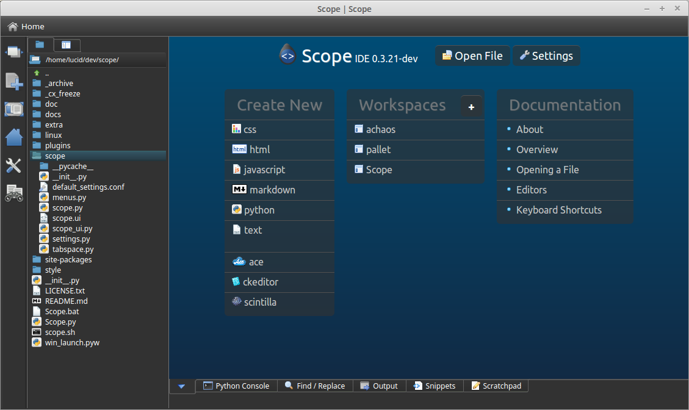
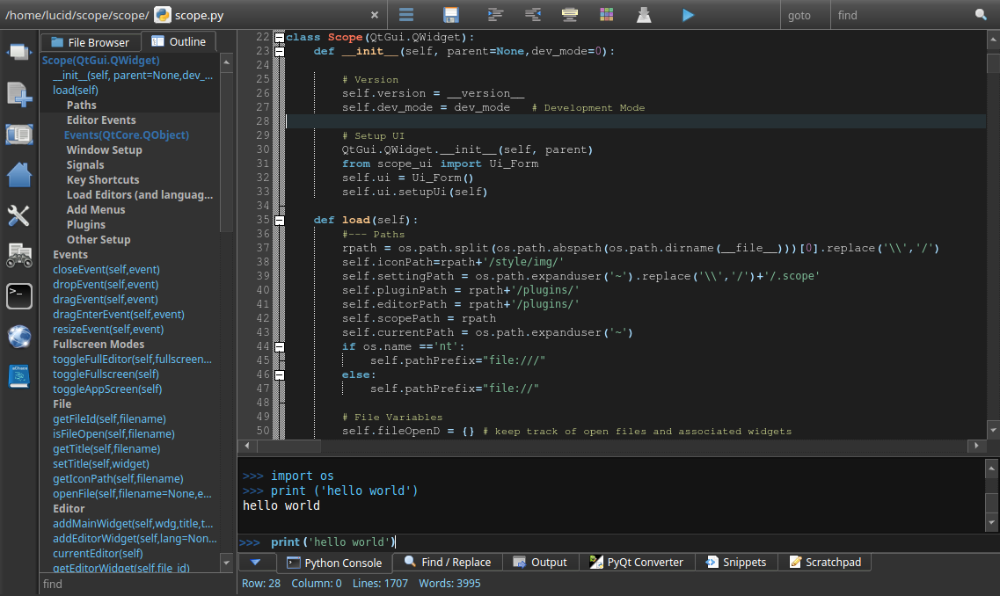
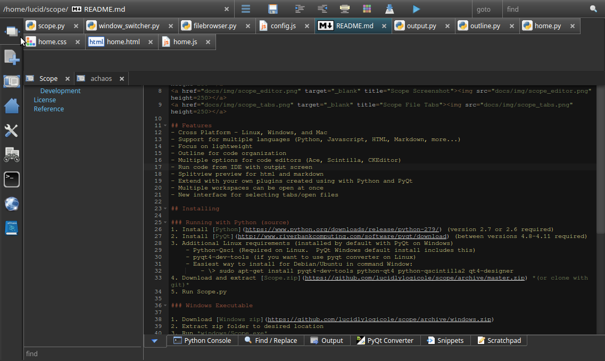

_**Scope is currently in beta stage.** For more information on where this is going, please see the [roadmap](docs/roadmap.md)_

#  Scope IDE
Scope is a lightweight, cross-platform IDE for Python, web development and more. Scope is primarily coded in Python with PyQt for the main UI with some html5 interfaces via Qt's built-in WebKit browser (QWebView).

## Screenshots
<a href="docs/img/scope_home.png" target="_blank" title="Scope Home Screen"></a>
<a href="docs/img/scope_editor.png" target="_blank" title="Scope Screenshot"></a>
<a href="docs/img/scope_tabs.png" target="_blank" title="Scope File Tabs"></a>

## Features
- A lightweight IDE with a clean interface that maximizes screen usage
    - looks good on small and large displays
    - Keyboard shortcuts to show/hide the plugins (left, bottom, right)
- An innovate window switcher with multiple rows of file tabs and allows multiple workspaces open at once
- Support for multiple languages (Python, Javascript, HTML, Markdown, more...)
- Multiple options for code editors (Ace, Scintilla, CKEditor)
    - A WYSIWYG html editor via CKEditor
- Standard plugins
    - Code Outline - for organizing/transversing code
    - Run/Compile code within Scope with an output screen
    - Filebrowser - view, open, create files
    - Splitview preview for html and markdown
    - Built in WebKit webbrowser
    - Search in files plugin
    - Install and enable plugins through the Settings interface
- Extend with your own plugins created with Python and PyQt
- Works on Linux, Windows, and Mac

## Installing

### Running with Python (source)
1. Install [Python 2.7](https://www.python.org/downloads/)
2. Install [PyQt4](http://www.riverbankcomputing.com/software/pyqt/download) (between versions 4.8-4.11)
3. Additional Linux requirements (PyQt comes with these on Windows)
    - Python-Qsci
    - pyqt4-dev-tools (only needed if you use the PyQt Converter plugin)
    - For Debian/Ubuntu in command Window:
        - sudo apt-get install pyqt4-dev-tools python-qt4 python-qscintilla2 qt4-designer
4. Download and extract [Scope.zip](https://github.com/lucidlylogicole/scope/archive/master.zip) *(or clone with git)*
5. Run Scope.py 
    - ```python Scope.py```
        - or whatever your Python 2.7 command is

### Windows Executable
Python does not need to be installed for this version. This is essentially a portable version that does not require installation

1. Download [Windows zip](https://github.com/lucidlylogicole/scope/archive/windows.zip)
2. Extract zip folder to desired location
3. Run *windows/Scope.exe*

### Development
The latest development (unstable) version is available here: [here](https://github.com/lucidlylogicole/scope/tree/dev)

## License
- **[License](LICENSE.txt)** - GNU General Public License (GPL 3) - required by PyQt

## Reference
Thanks to the following tools that Scope is built on:

- [Python](http://python.org) 
- [PyQt](http://www.riverbankcomputing.com/software/pyqt) - UI
- [Scintilla](http://www.scintilla.org/)/QsciScintilla (via [PyQt](http://www.riverbankcomputing.com/software/pyqt))
- [Ace Editor](http://ace.c9.io/) - HTML5 based code editor
- [CKEditor](http://ckeditor.com/) - rich text html WYSIWIG editor
- [Silk Icons](http://www.famfamfam.com/lab/icons/silk/) - main ui icon set
- [cx_Freeze](http://cx-freeze.sourceforge.net/) - for generating Windows and Linux binaries
- [File Icon Set](https://github.com/teambox/Free-file-icons) - for most file type icons
- [CommonMark.py](https://github.com/rolandshoemaker/CommonMark-py) - utilized for [markdown](http://commonmark.org/)