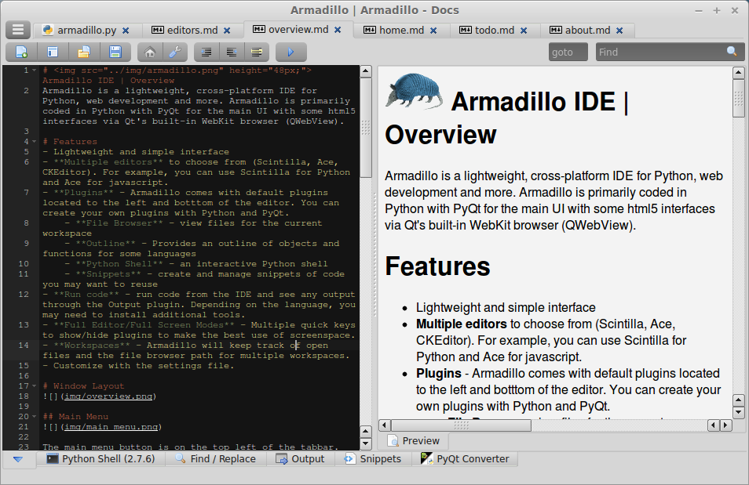
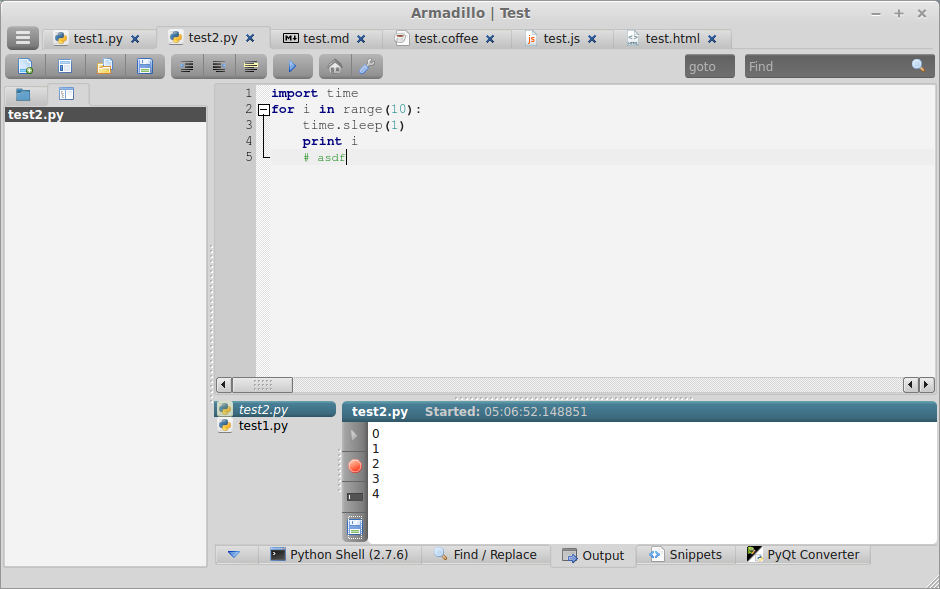
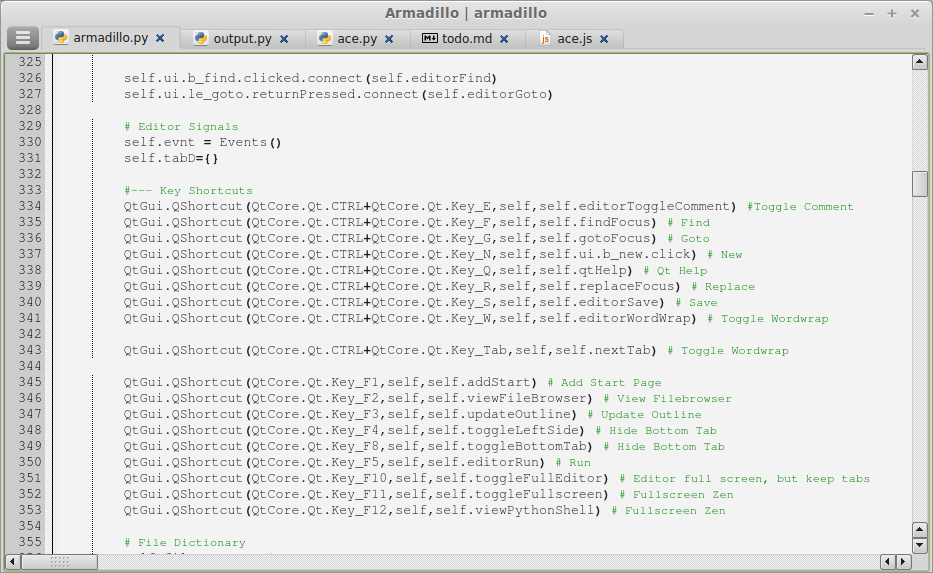

_**WARNING: This development version of Scope is not suitable for use**_

*This version is in the middle of a redesign without tabs and is buggy.*

#  Scope IDE
Scope is a lightweight, cross-platform IDE for Python, web development and more. Scope is primarily coded in Python with PyQt for the main UI with some html5 interfaces via Qt's built-in WebKit browser (QWebView).

# Screenshots

## Features
- Cross Platform - Linux, Windows, and Mac (not tested)
- Support for multiple languages (Python, Javascript, HTML, Markdown, more...)
- Focus on lightweight
- Outline for code organization
- Multiple options for code editors (Ace, Scintilla, CKEditor)
- Run code from IDE with output screen
- Splitview preview for html and markdown
- Extend with your own plugins created with Python and PyQt
- Head-up-display for selecting open files (F1)

## Installing
### Windows Executable
1. [Download Windows zip](https://github.com/lucidlylogicole/scope/archive/windows.zip)
2. Extract zip folder somewhere
3. Run windows/Scope.exe

### Linux and Mac 
See next section (Running with Python)

### Running with Python (source)
1. Install [Python](https://www.python.org/downloads/release/python-279/) (version 2.7 or 2.6 required)
2. Install [PyQt](http://www.riverbankcomputing.com/software/pyqt/download) (between versions 4.8-4.11 required)
2. Additional Linux requirements (installed by default with PyQt on Windows)
    - Python-Qsci (Required on Linux.  PyQt Windows default install includes this)
    - pyqt4-dev-tools (if you want to use pyqt converter on Linux)
    - Easiest way to install for Debian/Ubuntu in command Window:
        - \> sudo apt-get install pyqt4-dev-tools python-qt4 python-qscintilla2 qt4-designer
3. Run Scope.py

### Development
The latest development version is available [here](https://github.com/lucidlylogicole/scope/tree/dev)

## License
- **[License](LICENSE.txt)** - GNU General Public License (GPL 3)

## Reference
Thanks to the following tools that Scope is built on:

- [Python](http://python.org) 
- [PyQt](http://www.riverbankcomputing.com/software/pyqt) - UI
- [Scintilla](http://www.scintilla.org/)/QsciScintilla (via [PyQt](http://www.riverbankcomputing.com/software/pyqt))
- [Ace Editor](http://ace.c9.io/) - HTML5 based code editor
- [CKEditor](http://ckeditor.com/) - rich text html WYSIWIG editor
- [Silk Icons](http://www.famfamfam.com/lab/icons/silk/) - main ui icon set
- [cx_Freeze](http://cx-freeze.sourceforge.net/) - for generating Windows and Linux binaries
- [File Icon Set](https://github.com/teambox/Free-file-icons) - for most file type icons
- [ConfigObj.py](http://www.voidspace.org.uk/python/configobj.html) - for settings file
- [CommonMark.py](https://github.com/rolandshoemaker/CommonMark-py) - utilized for [markdown](http://commonmark.org/)