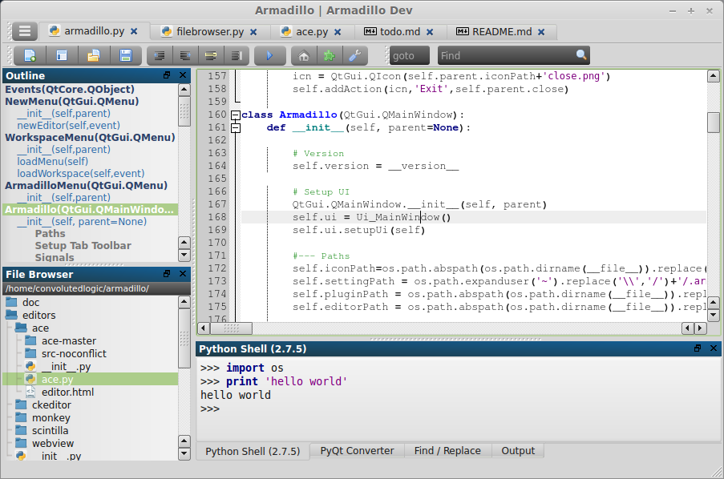

#  Armadillo IDE

## About
Armadillo is a lightweight, cross-platform IDE primarily for Python and Web Development, while also providing an editor for most languages. Armadillo is inspired by SPE, Geany, Notepad++ and Spyder. Armadillo is written in Python with PyQt for the UI. Some HTML5 is utilized for the ui with Qt's built in WebKit (QWebView).

## Features:
- Cross Platform (Linux, Windows, and maybe Mac)
- Support for multiple languages (Python, Javascript, HTML,...)
- Mostly lightweight
- Code outline for code organization
- Easily create plugins with Python and PyQt
- Multiple options for code editors (Ace, Scintilla, CKEditor, more...)

## Requirements
Armadillo must be run with Python. It has only been tested on Linux (Mint 15/16) and Windows 7.

- Python 2.6-2.7
- PyQt 4.8-4.10
- Additional Linux requirements
    - Python-Qsci (Required on Linux.  PyQt Windows default install includes this)
    - pyqt4-dev-tools (if you want to use pyqt converter on Linux)
    - For Debian/Ubuntu in command Window:
        - \> su
        - \> apt-get install pyqt4-dev-tools python-qt4 python-qscintilla2 qt4-designer
- Optional
    - markdown-python (if not installed it includes [markdown2](https://github.com/trentm/python-markdown2))

## Installing/Launching
1. Install Python and PyQt (and Linux packages if it applies)
2. Linux - Set armadillo.sh properties to execute and run.
4. Windows - Run armadillo.py

## More Stuff
- **[Overview](doc/overview.md)** - Overview of main window features
- **[Editors](doc/editors.md)** - multiple code editors are available
- **[Plugins](doc/plugins.md)** - comes with default plugins
    - [Outline](doc/plugins_outline.md) - Outline plugin for code organization
    - Python Shell - integrated Python Interpreter
    - PyQt Converter - convert Qt ui files to PyQt .py files
    - Find / Replace - advanced find/replace tool
    - Snippets - store and retreive useful code snippets
- **[Settings](doc/settings.md)** - settings are stored in config file
- **[License](LICENSE)** - GNU General Public License (GPL 3)
- **[Keyboard Shortcuts](doc/keyboard_shortcuts.html)**
- **[Roadmap](extra/roadmap.md)** - The current state of Armadillo and future plans
- **[Todo](extra/todo.md)** - List of to do and status

## Reference
Thanks to the following tools that Armadillo is built on:

- [Python](http://python.org) 
- [PyQt](http://www.riverbankcomputing.com/software/pyqt) - UI
- [Scintilla](http://www.scintilla.org/)/QsciScintilla (via [PyQt](http://www.riverbankcomputing.com/software/pyqt))
- [Ace Editor](http://ace.c9.io/) - HTML5 based code editor
- [CKEditor](http://ckeditor.com/) - rich text html WYSIWIG editor
- [Silk Icons](http://www.famfamfam.com/lab/icons/silk/) - main ui icon set
- [Python Markdown2](https://github.com/trentm/python-markdown2) - for generating html from markdown
- [File Icon Set](https://github.com/teambox/Free-file-icons) - for most file type icons
- [ConfigObj](http://www.voidspace.org.uk/python/configobj.html) - for settings file