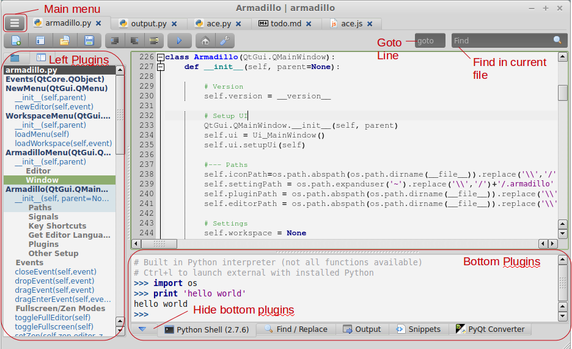
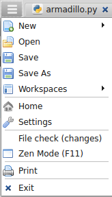
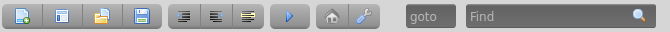

#  Armadillo IDE | Overview
Armadillo is a lightweight, cross-platform IDE for Python, web development and more. Armadillo is primarily coded in Python with PyQt for the main UI with some html5 interfaces via Qt's built-in WebKit browser (QWebView).

# Features
- Lightweight and simple interface
- **Multiple editors** to choose from (Scintilla, Ace, CKEditor). For example, you can use Scintilla for Python and Ace for javascript.
- **Plugins** - Armadillo comes with default plugins located to the left and botttom of the editor. You can create your own plugins with Python and PyQt.
    - **File Browser** - view files for the current workspace
    - **Outline** - Provides an outline of objects and functions for some languages
    - **Python Shell** - an interactive Python shell
    - **Snippets** - create and manage snippets of code you may want to reuse
- **Run code** - run code from the IDE and see any output through the Output plugin. Depending on the language, you may need to install additional tools.
- **Full Editor/Full Screen Modes** - Multiple quick keys to show/hide plugins to make the best use of screenspace.
- **Workspaces** - Armadillo will keep track of open files and the file browser path for multiple workspaces.
- Customize with the settings file.

# Window Layout

## Main Menu

The main menu button is on the top left of the tabbar.  It contains all toolbar functions and a few more.

-  **New** - menu with list of default languages and all editor languages
-  **Workspaces** - Show the workspace menu (to create, delete, or open an existing workspace)
-  **Open** - Popup to select a file
-  **Save** - Save the current open tab
-  **Save As** - Save the current open tab as another name (this will create a copy)

- **Editor** - Functions for the editor including indent, wordwrap, view whitespace and more.
- **Window** - Show/Hide different parts of the IDE. Full Editor and Full Screen mode area also available here.
-  **Home** - Show the main/start page
-  **Settings** - Open and edit the settings file

- **File Check (changes)** - checks if any of the open files have been modified outside this editor. This also checks to see if the file was deleted outside the editor.
- **Print** - Print the current tab

## Toolbar

The toolbar is available for convenience, but can also be hidden as all functions are available through [keyboard](keyboard_shortcuts.html) functions or the main menu.

-  **New File** - menu with list of default languages and all editor languages
-  **Workspace** - Show the workspace menu (to create, delete, or open an existing workspace)
-  **Open** - Popup to select a file
-  **Save** - Save the current open tab
-  **Indent** - Indent the current line/selection
-  **Unindent** - Unindent the current line/selection
-  **Comment** - Toggle the current line/selection as commented or uncommented (uses first line of selection to determine
-  **Run** - Run current file (Supported languages: Python, HTML, Markdown)
-  **Home** - Show the main/start page
-  **Settings** - Open and edit the settings file
- **Goto** - goto a line (Ctrl + G will place the cursor here)
- **Find** - find text in the editor (Ctrl + F will place the cursor here). For more advanced find options use the find/replace plugin.

## Workspaces
Multiple workspaces can be created in Armadillo to manage multiple projects with different views for each project.

The following settings are saved for each workspace:

- Base path in file browser
- Last opened files

## Editor
- A given file can only be open in one tab
- Ctrl + Tab will toggle through the open editor tabs
- Drag and drop files onto the editor to open them
- Files are saved as utf-8
- Tab indentation is 4 spaces