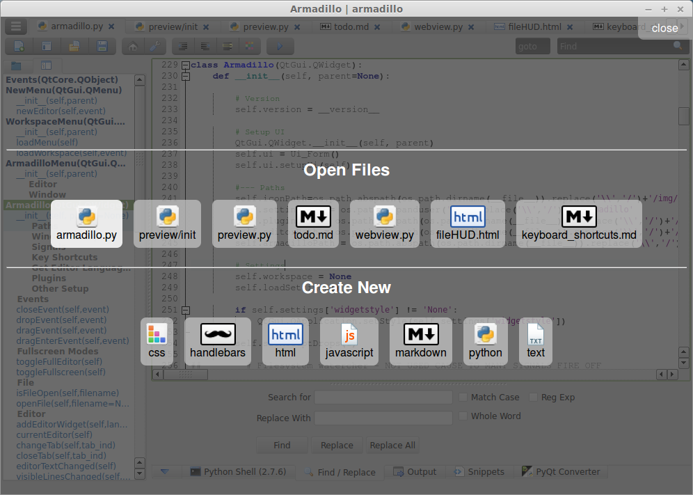

#  Armadillo IDE | Overview

# Window Layout

Armadillo has useful [keyboard shortcuts](keyboard_shortcuts.md) to hide/show parts of the IDE to best utilize screen space. Plugins are easily accessible, yet can stay out of the way.

- F1 - Show/Hide the Heads-Up-Display
- F4 - Show/Hide left plugins
- F8 - Show/Hide right plugins (preview)
- F9 - Show/Hide bottom plugins
- F10 - Hide all plugins and toolbar (keeps tabs open)
- F11 - Full Screen

## Main Menu

The main menu button is on the top left of the tabbar.  It contains all toolbar functions and a few more.

-  **New** - menu with list of default languages and all editor languages
-  **Workspaces** - Show the workspace menu (to create, delete, or open an existing workspace)
-  **Open** - Popup to select a file
-  **Save** - Save the current open tab
-  **Save As** - Save the current open tab as another name (this will create a copy)

- **Editor** - Functions for the editor including indent, wordwrap, view whitespace and more.
- **Window** - Show/Hide different parts of the IDE. Full Editor and Full Screen mode area also available here.
-  **Home** - Show the main/start page
-  **Settings** - Open and edit the settings file

- **File Check (changes)** - checks if any of the open files have been modified outside this editor. This also checks to see if the file was deleted outside the editor.
- **Print** - Print the current tab

## Toolbar

The toolbar is available for convenience, but can also be hidden as all functions are available through [keyboard](keyboard_shortcuts.md) functions or the main menu.

-  **New File** - menu with list of default languages and all editor languages
-  **Workspace** - Show the workspace menu (to create, delete, or open an existing workspace)
-  **Open** - Popup to select a file
-  **Save** - Save the current open tab
-  **Home** - Show the main/start page
-  **Settings** - Open and edit the settings file
-  **Indent** - Indent the current line/selection
-  **Unindent** - Unindent the current line/selection
-  **Comment** - Toggle the current line/selection as commented or uncommented (uses first line of selection to determine
-  **Color Picker** - Select a color and insert the rgb or rgba (if alpha less than 255)
-  **Run** - Run current file (Supported languages: Python, HTML, Markdown)
- **Goto** - goto a line (Ctrl + G to focus)
- **Find** - find text in the editor (Ctrl + F to focus). For more advanced find options use the find/replace plugin.

## Workspaces
Multiple projects can be managed in Armadillo by using workspaces. Each workspace keeps track of the following:

- Last open files/tabs (on close) 
- What editor the file was open with
- The last open file
- The base path of the project (in the file browser)

## Heads Up Display (HUD)
When many tabs are open, it can be a pain to navigate between the first and last tabs. The HUD aims to fix this and can be utilized with just the keyboard.

- F1 toggles the HUD and you can use the arrows to navigate between open files.
- The selected tab is highlighted.  Press enter to select the file and close the HUD.
- Clicking on a file also works
- You can also use the HUD to create new files
- More functionality is planned for the HUD in the future

## Editor/Files
Armadillo comes with multiple editors for flexibility with the many languages out there.

- A given file can only be open in one tab
- Ctrl + Tab will toggle through the open editor tabs
- Drag and drop files onto the editor to open them
- Files are saved as utf-8
- Tab indentation is 4 spaces
- Files are NOT automatically saved like some editors are doing.

**[More Info on the Editors](editors.md)**