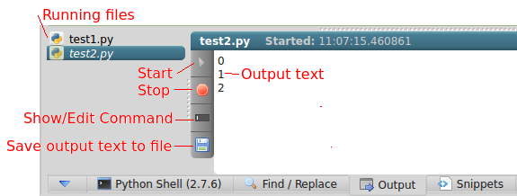

<link rel="stylesheet" type="text/css" href="doc.css">

# [Home](start.html) | [Plugins](plugins.md) | Output

The run button  uses the output plugin to run code and display output from the code. Multiple files can be running at once  and they run in a separate process from the IDE.

# Screen Overview

# Set up your language to run
1. Click the settings button  to edit your settings.
2. In the *prog_lang* section, add/edit the run attribute for the language.

        [prog_lang]
            [[python]]
                run=python -u

## Notes
- The run argument contains the command or path to the executable to run your code 
- Include additional arguments at the end. For Python, -u makes the output update as the code runs instead displaying only when it finishes.
-  Before executing the code, the current directory is changed to the file being run.
-  Make sure the appropriate software is installed and settings are set up as described above. For example, to run javascript in node, node must be installed.
- The command is built as:

        <run> <filename>
        python -u test.py

# How to Run Code
1. Click the run button  (or F5) in the top toolbar to execute the code.

# Examples of different language settings

        [prog_lang]
            # Javascript/Node
            [[javascript]] 
                run=/home/username/nodejs/bin/node -i
            
            # CoffeeScript
            [[coffee]] 
                run=coffee -p --print
            
            # Python (Use full python path if python command not in system path)
            [[python]]
                run=C:\python27\python -u

*Appropriate software needs to be installed before this will work.*