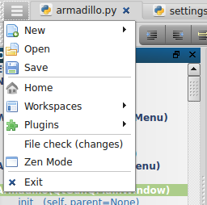
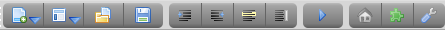

<link rel="stylesheet" type="text/css" href="doc.css">

# [Home](start.html) | Overview
Armadillo is a lightweight, cross-platform IDE primarily for Python and Web Development, while also providing an editor for most languages. Armadillo is inspired by SPE, Geany, Notepad++ and Spyder. Armadillo is written in Python with PyQt for the UI. Some HTML5 is utilized for the ui with Qt's built in WebKit (QWebView).

## Features
- **Zen Mode** - Toggle Zen mode (F11) to hide plugins and toolbar (tab bar is still visible)
- **Run** - Run current file (Supported languages: Python, HTML, Markdown)
- **Custom Settings** - choose the default editor for each language, and choose your favorite languages
- **Workspaces** - Save multiple workspaces to manage multiple projects (directory path, visible plugins, last opened files)

## Main Window Functions

### Main Menu

The main menu button is on the top left of the tabbar and stays open during Zen Mode

-  **New** - menu with list of default languages and all editor languages
-  **Open** - Popup to select a file
-  **Save** - Save the current open tab
-  **Home** - Show the main/start page
-  **Workspaces** - Show the workspace menu (to create, delete, or open an existing workspace)
-  **Plugins** - Toggle on/off the plugin dockwidgets and toolbars
-  **Settings** - Open and edit the settings file
- **File Check (changes)** - checks if any of the open files have been modified outside this editor. This also checks to see if the file was deleted outside the editor.
-  **Zen Mode** - Toggle Zen mode (F11) to hide plugins and toolbar (tab bar is still visible)

### Toolbar

The toolbar is available for convenience, but can also be hidden as all functions are available through [keyboard](keyboard_shortcuts.html) functions or the main menu.

-  **New File** - menu with list of default languages and all editor languages
-  **Workspace** - Show the workspace menu (to create, delete, or open an existing workspace)
-  **Open** - Popup to select a file
-  **Save** - Save the current open tab
-  **Indent** - Indent the current line/selection
-  **Unindent** - Unindent the current line/selection
-  **Comment** - Toggle the current line/selection as commented or uncommented (uses first line of selection to determine
-  **WordWrap** - Toggle on/off wordwrap for the current open tab
-  **Run** - Run current file (Supported languages: Python, HTML, Markdown)
-  **Home** - Show the main/start page
-  **Plugins** - Toggle on/off the plugin dockwidgets and toolbars
-  **Settings** - Open and edit the settings file