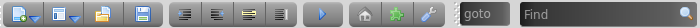

<link rel="stylesheet" type="text/css" href="doc.css">

# [Home](start.html) | Overview
Armadillo is a lightweight, cross-platform IDE primarily for Python and Web Development, while also providing an editor for most languages. Armadillo is inspired by SPE, Geany, Notepad++ and Spyder. Armadillo is written in Python with PyQt for the UI. Some HTML5 is utilized for the ui with Qt's built in WebKit (QWebView).

## Features
- **Zen Mode** - Toggle Zen mode (F11) to hide plugins and toolbar (tab bar is still visible)
- **Run** - Run current file (Supported languages: Python, HTML, Markdown)
- **Custom Settings** - choose the default editor for each language, and choose your favorite languages
- **Workspaces** - Save multiple workspaces to manage multiple projects (directory path, visible plugins, last opened files)

## Main Menu

The main menu button is on the top left of the tabbar and is available during Zen Mode.  It contains functions that are not necessarily tied to a keyboard shortcut

-  **New** - menu with list of default languages and all editor languages
-  **Open** - Popup to select a file
-  **Save** - Save the current open tab
-  **Home** - Show the main/start page
-  **Workspaces** - Show the workspace menu (to create, delete, or open an existing workspace)
-  **Plugins** - Toggle on/off the plugin dockwidgets and toolbars
-  **Settings** - Open and edit the settings file
- **File Check (changes)** - checks if any of the open files have been modified outside this editor. This also checks to see if the file was deleted outside the editor.
-  **Zen Mode** - Toggle Zen mode (F11) to hide plugins and toolbar (tab bar is still visible)

## Toolbar

The toolbar is available for convenience, but can also be hidden as all functions are available through [keyboard](keyboard_shortcuts.html) functions or the main menu.

-  **New File** - menu with list of default languages and all editor languages
-  **Workspace** - Show the workspace menu (to create, delete, or open an existing workspace)
-  **Open** - Popup to select a file
-  **Save** - Save the current open tab
-  **Indent** - Indent the current line/selection
-  **Unindent** - Unindent the current line/selection
-  **Comment** - Toggle the current line/selection as commented or uncommented (uses first line of selection to determine
-  **WordWrap** - Toggle on/off wordwrap for the current open tab
-  **Run** - Run current file (Supported languages: Python, HTML, Markdown)
-  **Home** - Show the main/start page
-  **Plugins** - Toggle on/off the plugin dockwidgets and toolbars
-  **Settings** - Open and edit the settings file
- **Goto** - goto a line (Ctrl + G will place the cursor here)
- **Find** - find text in the editor (Ctrl + F will place the cursor here). For more advanced find options use the find/replace plugin.
 
## Workspaces
Multiple workspaces can be created in Armadillo to manage multiple projects with different views for each project.

The following settings are saved for each workspace:

- Base path in file browser
- Last opened files
- What plugins and toolbars are visible

## Editor
- A given file can only be open in one tab
- Ctrl + Tab will toggle through the open editor tabs
- Drag and drop files into the tab area to open them (in Windows this is sometimes finicky)
- Files are saved as utf-8
- Tab indentation is 4 spaces

##  Run
- The run function works with the following file types:
    - **Python** - runs in an external process and displays any output in the Output plugin.  (Only one Python file can be run at a time)
    - **HTML** - opens in external browser
    - **Markdown** - loads in a preview tab