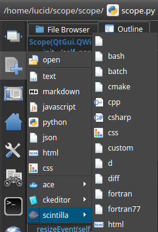
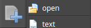

<link rel="stylesheet" type="text/css" href="docs.css">

# [Scope Documentation](index.md) | Opening a File

## Create a new file

1. Click on the new menu button on the left toolbar
2. Choose from one of the favorite file types

    or
    
   Select an editor and open the desired file type in that editor

## Open an Existing File - Browse

1. Click on the new menu button on the left toolbar
    
2. Click the open option.
3. Browse to find the desired file

## Open an Existing File - Drag and Drop

1. Drag a file from a file manager onto Scope

## Open an Existing File - File Browser

A file can also be opened by double clicking on the file in the File Browser plugin.

## Set a file type to open with Scope
If you would like to launch (double click on) a file from the operating system and open it with Scope, it will have to be set up from the operating system settings (for now). Usually, this can be done by right clicking on the file and choosing the *Open With* option and then setting Scope as the default program.

